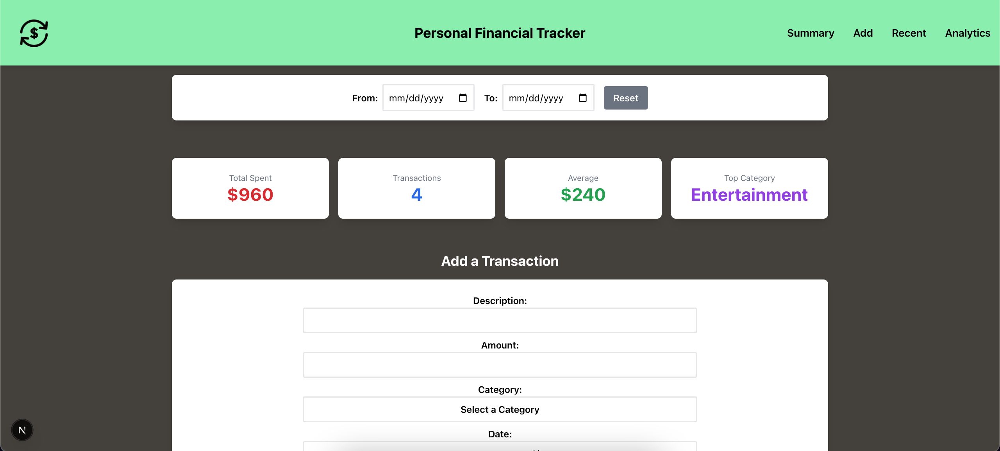
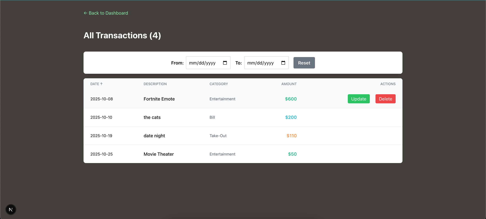
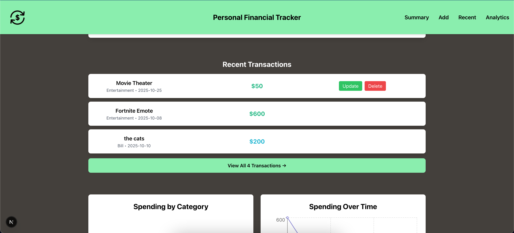
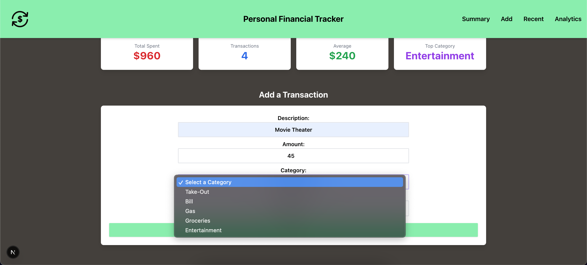
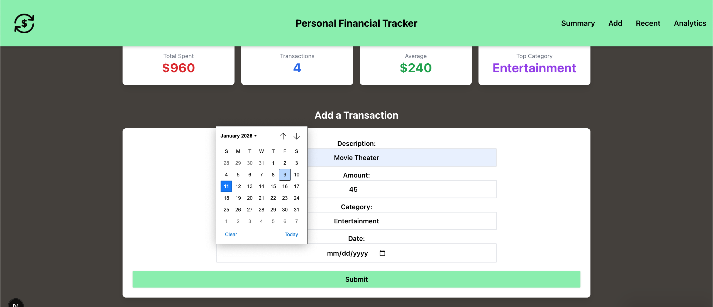
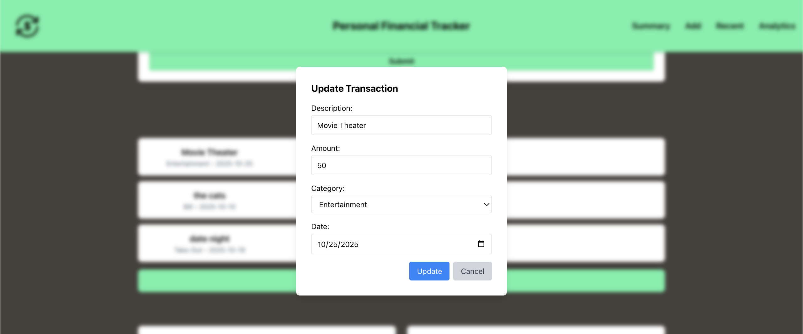
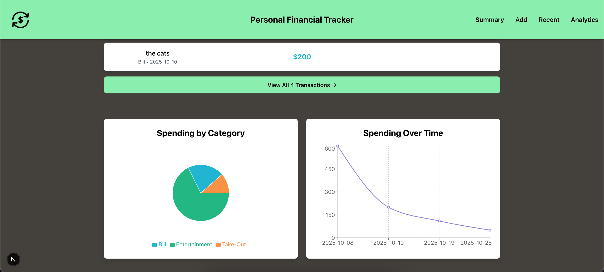

# Personal Financial Tracker

A full-stack financial management application built with Next.js, React, and Go, featuring an interactive dashboard with data visualizations, real-time metrics, and comprehensive transaction management.

## 📚 Documentation
- **[User Guide](README.md)** - Getting started, features, and installation
- **[Technical Overview](TECHNICAL_OVERVIEW.md)** - Architecture, implementation details, and technical challenges

## 📸 Screenshots

### Dashboard Overview


### Transaction Management



### Add Transaction



### Update Transaction Modal


### Data Visualization



## 🚀 Features

- **Interactive Dashboard**: Real-time summary of income, expenses, and balance with visual charts
- **Transaction Management**: Full CRUD operations for tracking financial transactions
- **Data Visualization**: Recharts integration for spending patterns and trends analysis
- **Advanced Filtering**: Filter transactions by date range with URL query parameter persistence
- **Responsive Design**: Mobile-friendly interface built with Tailwind CSS
- **Modal-Based Editing**: Clean UX for adding and editing transactions
- **Form Validation**: Client-side validation ensuring data integrity
- **Optimized Performance**: In-memory caching on backend for fast data retrieval

## 🛠️ Tech Stack

**Frontend:**
- Next.js 15 (with Turbopack)
- React 19
- Recharts (data visualization)
- Tailwind CSS
- JavaScript (ES6+)

**Backend:**
- Go 1.24
- Gin Web Framework
- RESTful API architecture
- JSON file storage with in-memory caching
- CORS middleware for cross-origin requests

**Development Tools:**
- npm for package management
- Go modules for dependency management

## 📋 Prerequisites

Before running this project, make sure you have:
- Node.js (v18 or higher)
- npm
- Go (v1.24 or higher)

## 🔧 Installation & Setup

1. **Clone the repository**
```bash
git clone https://github.com/imhunterblake/Personal-Financial-Tracker.git
cd Personal-Financial-Tracker
```

2. **Install frontend dependencies**
```bash
cd financial-tracker-frontend/financial-tracker
npm install
```

3. **Install backend dependencies**
```bash
cd ../../financial-tracker-backend
go mod download
```

4. **Start the backend server**
```bash
go run main.go
# Server runs on http://localhost:8080
```

5. **Start the frontend development server** (in a new terminal)
```bash
cd ../financial-tracker-frontend/financial-tracker
npm run dev
# Application runs on http://localhost:3000
```

## 📁 Project Structure
```
Personal-Financial-Tracker/
├── financial-tracker-frontend/
│   └── financial-tracker/
│       ├── src/
│       │   ├── app/
│       │   │   ├── page.js              # Main dashboard page
│       │   │   ├── layout.js            # Root layout
│       │   │   ├── globals.css          # Global styles
│       │   │   └── transactions/
│       │   │       └── page.js          # All transactions page
│       │   ├── components/
│       │   │   ├── DateRangeFilter.jsx
│       │   │   ├── EditTransactionModal.jsx
│       │   │   ├── SpendingByCategory.jsx
│       │   │   ├── SpendingOverTime.jsx
│       │   │   └── SummaryCards.jsx
│       │   └── utils/
│       │       ├── apiHelpers.js
│       │       ├── constants.js
│       │       └── transactionHelpers.js
│       ├── public/
│       ├── screenshots/
│       ├── package.json
│       ├── tailwind.config.js
│       └── next.config.mjs
├── financial-tracker-backend/
│   ├── main.go                          # API server with all endpoints
│   ├── data/
│   │   └── transactions.json            # Transaction data storage
│   ├── go.mod
│   └── go.sum
└── README.md
```

## 🎯 API Endpoints

| Method | Endpoint | Description |
|--------|----------|-------------|
| GET | `/data/transactions` | Retrieve all transactions (with caching) |
| GET | `/data/transactions/:id` | Retrieve a specific transaction by ID |
| POST | `/data/transactions` | Create a new transaction |
| PATCH | `/data/transactions/:id` | Update an existing transaction |
| DELETE | `/data/transactions/:id` | Delete a transaction |

**Note:** All endpoints support CORS for cross-origin requests from the frontend.

## 💡 Key Learning Outcomes

This project demonstrates:
- **Full-Stack Development**: Building a complete application with separate frontend and backend
- **Modern React Development**: Using Next.js 15 with App Router and React 19 features
- **RESTful API Design**: Implementing clean, semantic API endpoints with proper HTTP methods
- **State Management**: Managing complex state with React hooks (useState, useEffect)
- **Performance Optimization**: In-memory caching with hashmaps for O(1) lookups
- **Data Visualization**: Creating interactive charts with Recharts library
- **Responsive Design**: Mobile-first UI with Tailwind CSS utility classes
- **URL State Management**: Persisting filter state in URL query parameters
- **Go Web Development**: Building HTTP servers with Gin framework
- **CORS Configuration**: Handling cross-origin requests securely
- **Asynchronous Operations**: Using async/await for API calls
- **Error Handling**: Implementing proper error handling on both client and server
- **File I/O**: JSON-based data persistence with read/write operations

## 🔜 Future Enhancements

- [ ] User authentication and authorization
- [ ] Database integration (PostgreSQL/MongoDB)
- [ ] Budget goal setting and tracking
- [ ] Recurring transaction support
- [ ] Export data to CSV/PDF
- [ ] Multi-currency support
- [ ] Category customization

## 🤝 Contributing

This is a personal learning project, but suggestions and feedback are welcome! Feel free to open an issue or submit a pull request.

## 📝 License

This project is open source and available under the [MIT License](LICENSE).

## 👨‍💻 Author

**Hunter Scoggins**
- GitHub: [@imhunterblake](https://github.com/imhunterblake)
- LinkedIn: [hunter-scoggins](https://www.linkedin.com/in/hunter-scoggins/)
- Email: hscoggins5018@gmail.com

---

*Built as part of my transition from Medical Laboratory Science to Software Development*